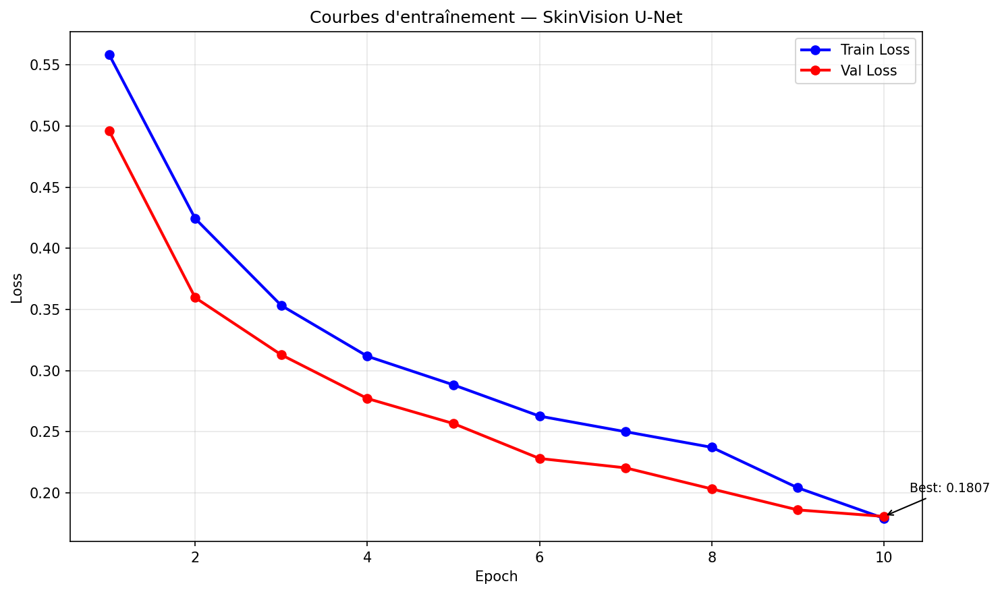

# SkinVision Pipeline 🔬

> Pipeline end-to-end d'analyse de peau par Computer Vision & Deep Learning.
> Preprocessing OpenCV → Segmentation U-Net PyTorch → Export ONNX

---

## 🎯 Résultats

| Métrique  | Score          |
|-----------|----------------|
| IoU       | X.XXX ± X.XXX  |
| Dice      | X.XXX ± X.XXX  |
| Precision | X.XXX ± X.XXX  |
| Recall    | X.XXX ± X.XXX  |

*(Remplace les X par tes vrais résultats après entraînement)*


---

## 🛠 Stack Technique


- **Preprocessing** : OpenCV (CLAHE, suppression reflets spéculaires, normalisation couleur)
- **Segmentation** : U-Net avec encoder MobileNetV2 pré-entraîné ImageNet
- **Loss** : Dice Loss + Binary Cross-Entropy combinées
- **Augmentation** : Albumentations (flip, rotation, variation photométrique)
- **Déploiement** : Export ONNX + validation numérique PyTorch/ONNX

---

## 📁 Structure

```
skinvision-pipeline/
├── src/
│   ├── preprocessing.py   # CLAHE, specular removal, normalisation
│   ├── dataset.py         # PyTorch Dataset + DataLoader + augmentations
│   ├── model.py           # U-Net + Dice Loss + Combined Loss
│   ├── train.py           # Boucle d'entraînement + scheduler + courbes
│   ├── evaluate.py        # IoU, Dice, Precision, Recall + visualisations
│   └── export.py          # Export ONNX + benchmark inférence
├── models/
│   └── unet_skin.onnx     # Modèle exporté (déploiement sans PyTorch)
├── requirements.txt
└── README.md
```

---

## 🚀 Installation

```bash
git clone https://github.com/yassir-zegrani/skinvision-pipeline
cd skinvision-pipeline

python -m venv venv
source venv/bin/activate    # Linux/Mac
# venv\Scripts\activate     # Windows

pip install -r requirements.txt
```

---

## 📊 Dataset

**PH2 Dataset** — 200 images dermoscopiques de lésions cutanées
- Source : [ADDI Project](https://www.fc.up.pt/addi/ph2%20database.html)
- Format : images RGB + masques binaires (lésion / fond)
- Split : 80% entraînement / 20% validation

---

## 🔄 Pipeline Détaillé

### 1. Preprocessing (`src/preprocessing.py`)
- **CLAHE** : amélioration contraste local dans l'espace Lab
- **Suppression reflets** : détection HSV + inpainting (cv2.INPAINT_TELEA)
- **Normalisation** : standardisation avec stats ImageNet (mean/std par canal)
- **Resize** : 128×128 (optimisé CPU)

### 2. Data Augmentation (`src/dataset.py`)
- HorizontalFlip, VerticalFlip, RandomRotate90
- RandomBrightnessContrast, HueSaturationValue
- Appliqué synchroniquement sur image ET masque (Albumentations)

### 3. Modèle U-Net (`src/model.py`)
- **Encoder** : MobileNetV2 pré-entraîné ImageNet (~3.4M params)
- **Decoder** : Up-sampling avec skip connections
- **Activation** : Sigmoid (sortie probabilité [0,1])
- **Loss** : 0.5 × BCE + 0.5 × Dice

### 4. Entraînement (`src/train.py`)
- Optimizer : Adam (lr=1e-4)
- Scheduler : ReduceLROnPlateau (patience=3, factor=0.5)
- 10 epochs sur CPU (~40 min avec 200 images 128×128)

### 5. Export ONNX (`src/export.py`)
- `torch.onnx.export()` avec dynamic batch axis
- Validation : différence PyTorch vs ONNX < 1e-4
- Benchmark : X ms/image sur CPU

---

## 💻 Usage

```bash
# Entraînement
python src/train.py

# Évaluation + visualisation
python src/evaluate.py
--------------------------------------------
Patients trouvés : 200
✓ Paires valides : 200
  Train : 160 | Val : 40
✅ Modèle chargé : models/unet_skin.pth

📊 Résultats sur Validation Set
Dice Score : 0.8932
IoU Score  : 0.8139

#Reulstat 
# Export ONNX
python src/export.py
```
============================================================
 Validation
============================================================

 Structure ONNX
  Inputs : ['input']
  Outputs: ['output']
  Nodes  : 208
  ✅ Modèle ONNX valide

🔍 Validation ONNX
  PyTorch output shape : (1, 1, 128, 128)
  ONNX output shape    : (1, 1, 128, 128)
  Différence max       : 1.01e-06
  ✅ Validation réussie (diff < 1e-4)

============================================================
⚡ Benchmark
============================================================

⚡ Benchmark Inférence (100 runs)
  Temps moyen   : 16.66 ms/image
  Écart-type    : 8.46 ms
  Throughput    : 60.0 images/sec

---

## 📈 Courbes d'entraînement



---

## 🎯 Contexte

Projet réalisé dans le cadre de la préparation à un poste d'ingénieur
Computer Vision & IA spécialisé en analyse dermatologique.

Stack identique à celle requise : Python · PyTorch · OpenCV · ONNX · Edge Computing

---

*Yassir Zegrani — [LinkedIn](https://linkedin.com/in/yassir-zegrani)*